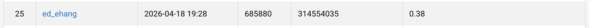
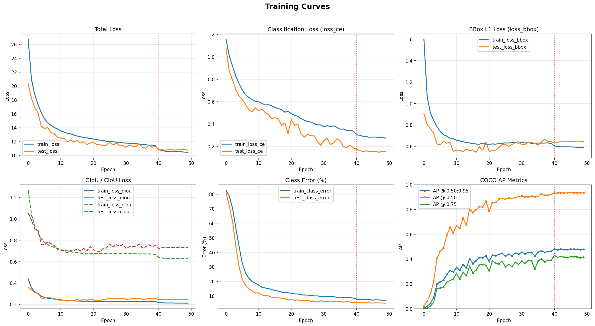

# NYCU Visual Recognition using Deep Learning HW2

**Student ID:** [314554035]
**Name:** [張翊鞍]

## Introduction
This repository contains the implementation for NYCU 2026 Spring Visual Recognition using Deep Learning Homework 2: **Digit Detection**.

The final solution is built upon **Conditional DETR** with a **ResNet-50** backbone (ImageNet pretrained). The model is adapted to a digit-detection setting with 10 foreground classes (digits 0–9) on a SVHN-style dataset of 46,470 images.

Key modifications from the vanilla Conditional DETR:

1. **IoU-aware loss fusion**: the bounding-box regression loss is extended from `L1 + GIoU` to `L1 + GIoU + CIoU`, with coefficients rebalanced (bbox : giou : ciou = 7 : 1 : 3) to put more pressure on strict-IoU localisation.
2. **Dataset-aware multi-scale training**: training short-side scales are chosen in `[128, 512]` with `max_size=600` to match the dataset's actual image statistics (median 111×49, p99 max-side = 489) instead of the 480–1333 range used for COCO.
3. **Light photometric augmentation**: `ColorJitter`, `GaussianBlur`, and `RandomGrayscale` are added to improve robustness to illumination and colour variance typical of street-view digits.
4. **Digit-specific hyper-parameters**: `num_queries=30` (≈5× the observed max of 6 digits per image) and `num_classes=11` (10 digits + background slot).

All inference is done through the same `PostProcess` used during validation, so the predictions submitted to CodaBench follow exactly the same code path as the internal mAP evaluation.

## Environment Setup
It is recommended to use Python 3.9 or higher with a virtual environment (e.g., Conda, Poetry, or Virtualenv).

To install the required dependencies, run:
```bash
pip install -r requirements.txt
```

Main dependencies:
- PyTorch >= 1.7.0
- torchvision >= 0.6.1
- pycocotools
- Cython, scipy, termcolor, tqdm, matplotlib

## Usage

### Dataset Preparation
Please ensure the dataset is placed in the root directory under the `./data` folder with the following structure:
```text
.
├── data/
│   ├── train/            # training images
│   ├── valid/            # validation images
│   ├── test/             # test images (for CodaBench submission)
│   ├── train.json        # COCO-format training labels
│   └── valid.json        # COCO-format validation labels
```
Notes on the label format:
- Bounding boxes are given in `[x_min, y_min, w, h]` (unnormalised).
- `category_id` starts from 1 (i.e., digits 0–9 are mapped to ids 1–10).

### Training
To train the final model (Conditional DETR with the GIoU + CIoU fused loss):
For example:
```bash
python main.py \
    --coco_path data \
    --output_dir output/cond_detr_digit \
    --batch_size 2 \
    --epochs 50 \
    --lr_drop 40 \
    --num_queries 30 \
    --bbox_loss_coef 7 \
    --giou_loss_coef 1 \
    --ciou_loss_coef 3 \
    --set_cost_bbox 7 \
    --set_cost_giou 3
```
- The training log is written to `output/cond_detr_digit/log.txt` (one JSON object per epoch).
- The best checkpoint (by validation mAP @ 0.75) is saved as `checkpoint_best.pth`.

### Inference
To generate the CodaBench submission file on the test set:
```bash
python inference.py
```
- The script loads `output/cond_detr_digit/checkpoint_best.pth`.
- All images in `data/test/` are resized (short-side 384, max-side 600) and passed through the model.
- The built-in `PostProcess` is used so that inference is identical to the validation-time evaluation.
- Predictions are written to `pred.json` in COCO format (`image_id`, `bbox=[x, y, w, h]`, `score`, `category_id`).

### Visualization

Plot training curves:
```bash
python plot_loss_curves.py \
    --log output/cond_detr_digit/log.txt \
    --out assets/loss_curves.png
```

Plot a detection-style confusion matrix (rows = GT, cols = prediction, last row/col = background = FN/FP):
```bash
python plot_confusion_matrix.py \
    --checkpoint output/cond_detr_digit_v7/checkpoint_best.pth \
    --coco_path data \
    --out assets/confusion_matrix_v7.png \
    --drop_classes 0          # drop the unused class-0 row/col
```

## Performance Snapshot

CodaBench public-leaderboard score (mAP @ IoU=0.50:0.95):



Training curves :



## References

1. Meng, D. et al. *Conditional DETR for Fast Training Convergence*, ICCV 2021. [[paper]](https://arxiv.org/abs/2108.06152) [[official code]](https://github.com/Atten4Vis/ConditionalDETR)
2. Carion, N. et al. *End-to-End Object Detection with Transformers (DETR)*, ECCV 2020. [[paper]](https://arxiv.org/abs/2005.12872)
3. Zheng, Z. et al. *Distance-IoU Loss: Faster and Better Learning for Bounding Box Regression*, AAAI 2020. [[paper]](https://arxiv.org/abs/1911.08287)

This implementation is adapted from the official Conditional DETR repository. The backbone, transformer, and matcher modules follow the original code; the loss function, training transforms, data pipeline, and inference script are modified for the digit-detection task.
